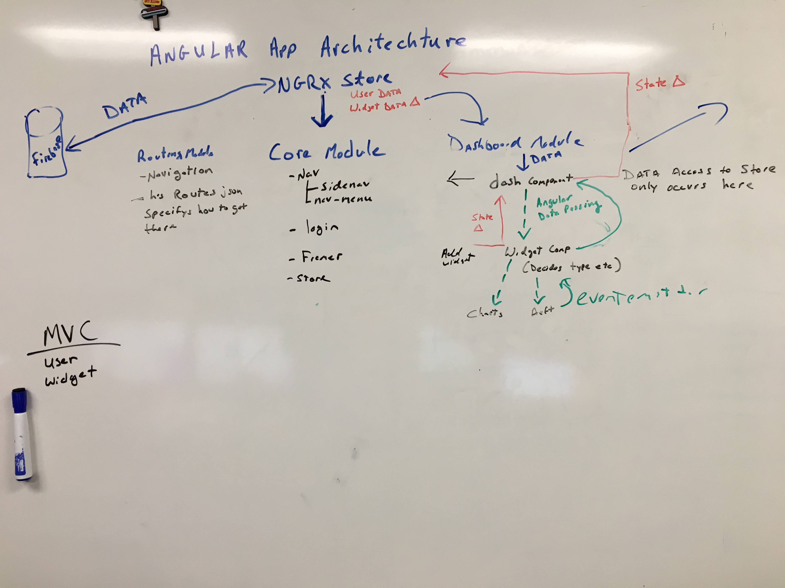
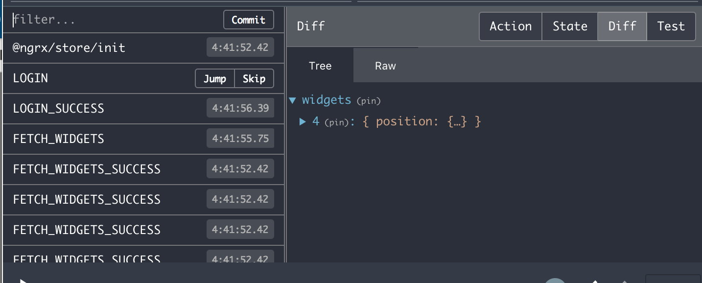
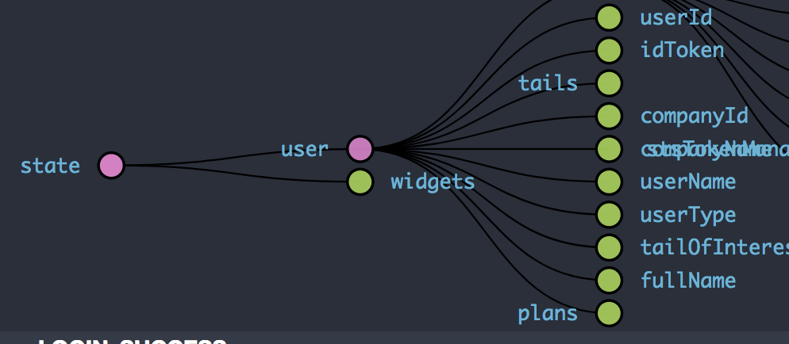

# NGRX

>Building Data store

## What 
We currently use ngrx/store for our data store
Documentation : https://github.com/ngrx/platform

## Try
https://gist.github.com/btroncone/a6e4347326749f938510

## Why
Enables us to have a datastore for our application

## Redux Dev tools
Install it has a lot of great features
https://github.com/gaearon/redux-devtools

## In action

