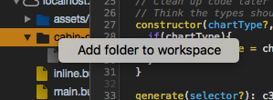
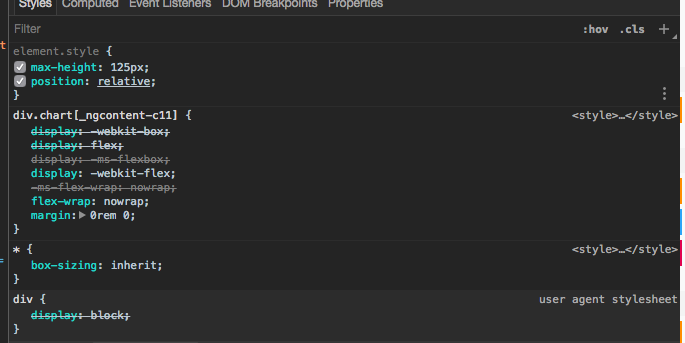

# Development for Project

## How
1. Create a feature branch
2. Develop your changes on the feature branch
3. Merge master into your branch and deal with conflicts here
4. Create a merge request to master
5. Have another dev code/review

## Definition of Done
1. Unittested
2. Dev Tested
3. Requirements met


## Continuous Integration via Gitlab ci
The `.gitlab-ci.yaml` file will displays how the current ci pipeline functions
Not currently though... FIX ME
The pipeline uses the latest [Docker Node Image](https://hub.docker.com/_/node/)

### Stages and Jobs

1. Clean 
    * Job: cleans the project
2. Build
    * Job Build: builds the project using `ng-cli` 
    * Job generateDocs: generates documentation via compodoc
3. Test
    * Job unittests: runs unittests on the project
    * Job static-analysis: runs tslint over the codebase and coverage documentation is put into public
4. Deploy
    * Job deploy-dev: Deploy the image to a dev-box
    * Job deploy-sat: Deploy to sat env
    * Job deploy-prod: Deploy to prod env

#### Running ci on your branch.

The default setting for the ci is to only run on master but if you want to run it on your branch
which you will probably need to do once in a while ;). Here is what to do

```yaml
clean:
  stage: clean
  script:
    - rm -rf ./dashboard-ui/dist
    - rm -rf ./dashboard-ui/node_modules
    - rm -rf ./dashboard-ui/coverage
  environment:
    name: shanes-deployment-env
  only:
    - $YOUR_BRANCHNAME # Modify this line here for your branch
```

After you make the change do a git commit and then check gitlab to see if it is
running

## Git 101 for cabin-dashboard devs
We are following the following branching strategy.
1. Create a branch you are going to do your work on
1. Do your work on that branch
1. Before creating a merge request ensure the pipeline runs on your branch all green
1. Create a merge request 
1. If everything is legit in the merge request we will merge the changes into master

### Cheat Sheet
Cheat sheet for git
https://services.github.com/on-demand/downloads/github-git-cheat-sheet.pdf

### Branching your code
Ensure you have a clean branch

```sh
git checkout master
git branch $YOURBRANCHNAME
git checkout $YOURBRANCHNAME
```

### Committing Your Code
```sh
git commit $YOURBRANCHNAME -m "$JIRATICKET - descriptive message"
```


### Using the logger
Logger supports typical logging levels
prod level - WARN
dev level - DEBUG

```
TRACE|DEBUG|INFO|LOG|WARN|ERROR|OFF
```

```typescript
import { Component } from '@angular/core';
import { NGXLogger } from 'ngx-logger';

@Component({
  selector: 'your-component',
  templateUrl: './your.component.html',
  styleUrls: ['your.component.less'],
  providers: [NGXLogger]
})
export class YourComponent {
    constructor(private logger: NGXLogger) {
        this.logger.debug('Your log message goes here');
    };
}

```


### Lodash


Great js/ts utility library. Provides a nice functional interface for working with objects
```js
var users = [
  { 'user': 'barney' },
  { 'user': 'fred' }
];

_.map(users, 'user');
// => ['barney', 'fred']

```


### Chrome as IDE

#### Map  Project directory
This will enable you to edit your source code via the sources tab in chrome


### Edit SCSS in chrome
Click on the elements tab and make changes to dom / scss and copy them into your code files. You can see the elements change on screen
